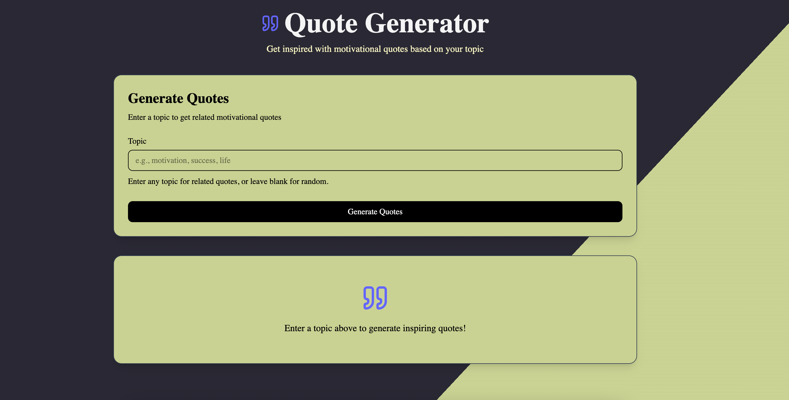
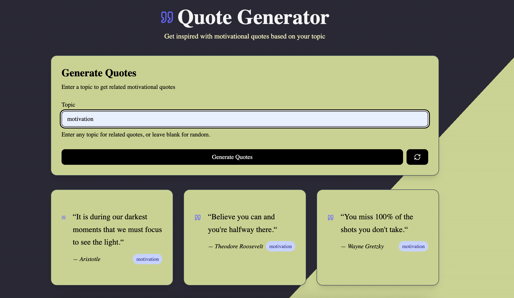
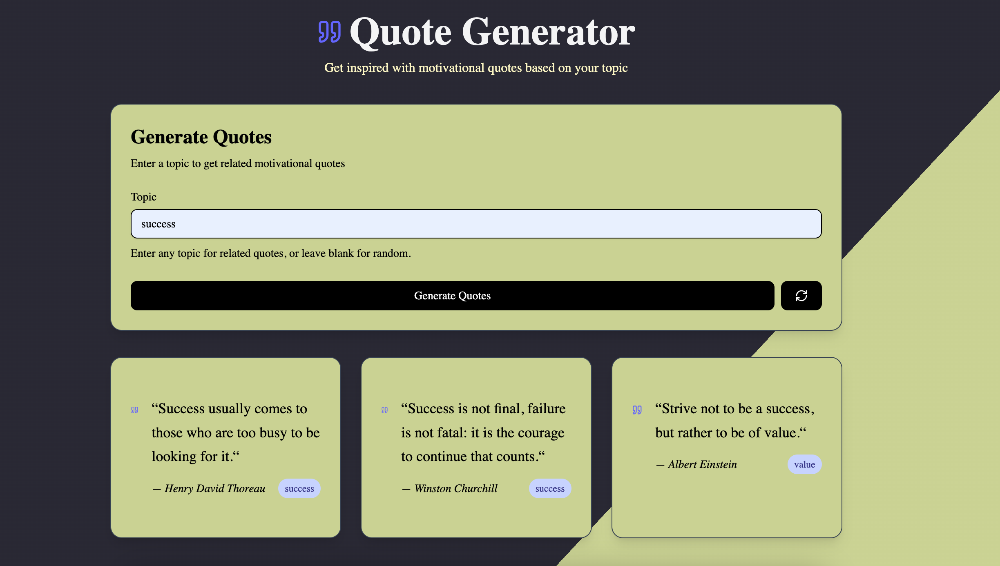

# Quote Generator

A modern, responsive Quote Generator app built with [Next.js](https://nextjs.org/), [shadcn/ui](https://ui.shadcn.com/), [Tailwind CSS](https://tailwindcss.com/), and TypeScript. Enter any topic and instantly get an inspiring quote related to it!

## 🚀 Live Demo

Try it out: [https://quote-generator-two-tau.vercel.app/](https://quote-generator-two-tau.vercel.app/)

---

## ✨ Features

- 🔎 **Topic-based Quotes:** Enter any topic and generate a relevant quote.
- ⚡ **Fast & Responsive:** Built with Next.js and optimized for all devices.
- 🎨 **Modern UI:** Styled with shadcn/ui and Tailwind CSS for a clean look.
- 🛡️ **TypeScript:** Type-safe codebase for reliability.
- ☁️ **Deployed on Vercel:** Instant global access.

---

## 🖼️ Screenshots

<!-- Add your screenshots here if available -->




---

## 🛠️ Tech Stack

- [Next.js](https://nextjs.org/)
- [TypeScript](https://www.typescriptlang.org/)
- [shadcn/ui](https://ui.shadcn.com/)
- [Tailwind CSS](https://tailwindcss.com/)

---

## 🧑‍💻 Getting Started

Clone the repository and install dependencies:

```bash
git clone https://github.com/AhmadR-11/Nexium_Ahmad_Assign1.git
cd Nexium_Ahmad_Assign1
npm install
```

Run the development server:

```bash
npm run dev
```

Open [http://localhost:3000](http://localhost:3000) in your browser to see the app.

---

## 📝 Usage

1. Enter a topic in the input field.
2. Click the **Generate Quote** button.
3. View the generated quote below.

---

## 📦 Folder Structure

```
/app           # Main Next.js app directory
/components    # Reusable UI components
/styles        # Tailwind and global styles
/public        # Static assets
```

---

## 📄 License

Made with ❤️ by Ahmad Raza 💗. Hope you like it. Don`t forget to make it star ⭐️